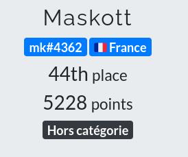
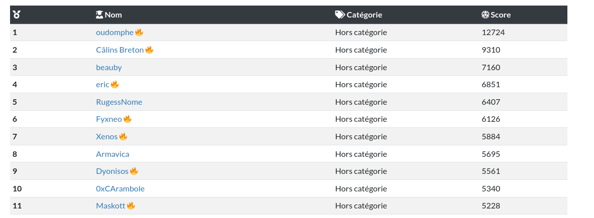

### FCSC 2022

Quelques write up du France CyberSecurity Challenge organisé par l'ANSSI du 29/04 au 08/05/2022.

#### Hardware
- [Daddy morse](hardware/dady_morse)
- [I2CYouToo](hardware/I2CyouToo)

#### MISC
- [Color Plant 1 & 2](misc/color_plant)

#### Side Channel
- [Never skip class nor multiply](side_channel/nscnm)
- [Never skip class nor squaring](side_channel/nscns)

#### Web
- [Login Portal](web/login_portal)

### Remerciement

Bravo à toute l'équipe de l'ANSSI pour ce CTF particulièrment réussi (pas de problème d'infra, suivi permanent des admins, bonne ambiance et memes)

Félicitation à tous les concépteurs de challenge pour leur justesse et leur variété.

### End game

Pour ma part je suis plutôt content d'une honorable 44e place au général, 11e en hors catégorie ... il m'a manqué pas grand chose sur les deux derniers jours pour faire encore mieux !

  

  

