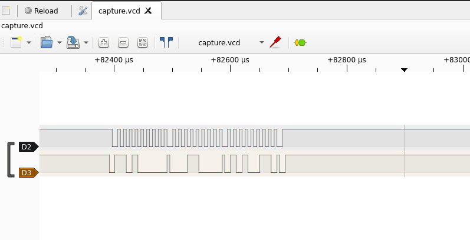
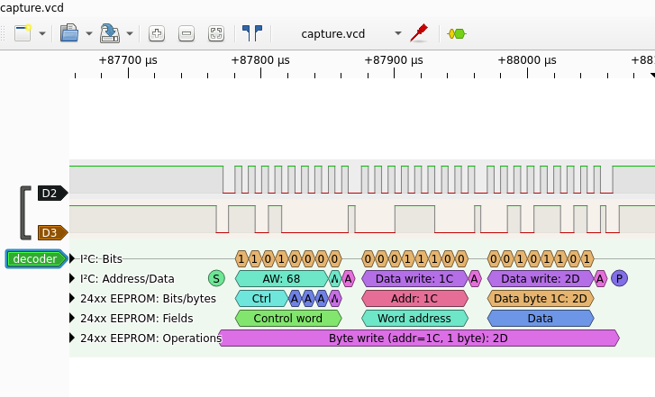

### HARDWARE / Daddy morse


### Files

Une capture d'analyseur logique nous est fournies, avec quelques indications :

- EEPROM 1024 bits sur un Arduino
- la capture correspond à la saisie d'un mot de passe
- utiliser Sigrok ou GtkWave


### Résolution

N'ayant pas de grande connaissances en analyse de hardwares, quelques recherches sur Google à partir des éléments ci-dessus permettent néanmoins de comprendre l'essentiel, et notamment que les logiciels conseillés vont tout faire tout seul ... avec la bonne configuration.

Pour ma part, j'ai installé Sigrok et la version graphique PulseView pour ouvrir la capture.





Deux signaux sont capturés, `D2` qui est régulier et doit correspondre à l'horloge, `D3` qui doit porter l'information.

On peut alors ajouter un décodeur à notre analyseur : `Add protocol decoder > 24xx I2C EEPROM`

En faisant quelques recherches sur internet, c'est celui qui m'a semblé le plus proche du matériel que l'on nous a décrit.

Une troisième ligne apparaît alors, il n'y a plus qu'à configurer le décodeur, et récupérer son interprétation des datas.




Le menu permet d'exporter les informations extraites au format texte.

```
50149125-50451750 24xx EEPROM: Operations: Byte write (addr=00, 1 byte): 46
51491187-51793812 24xx EEPROM: Operations: Byte write (addr=01, 1 byte): 43
52833812-53136437 24xx EEPROM: Operations: Byte write (addr=02, 1 byte): 53
54176125-54478750 24xx EEPROM: Operations: Byte write (addr=03, 1 byte): 43
55518187-55820812 24xx EEPROM: Operations: Byte write (addr=04, 1 byte): 7B
56864437-57167062 24xx EEPROM: Operations: Byte write (addr=05, 1 byte): 4D
58207562-58510187 24xx EEPROM: Operations: Byte write (addr=06, 1 byte): 59
59550125-59852750 24xx EEPROM: Operations: Byte write (addr=07, 1 byte): 2D
60892937-61195562 24xx EEPROM: Operations: Byte write (addr=08, 1 byte): 50
62235750-62538374 24xx EEPROM: Operations: Byte write (addr=09, 1 byte): 52
63578562-63881187 24xx EEPROM: Operations: Byte write (addr=0A, 1 byte): 45
64924687-65227312 24xx EEPROM: Operations: Byte write (addr=0B, 1 byte): 43
66267499-66570124 24xx EEPROM: Operations: Byte write (addr=0C, 1 byte): 49
67610312-67912937 24xx EEPROM: Operations: Byte write (addr=0D, 1 byte): 4F
68952875-69255500 24xx EEPROM: Operations: Byte write (addr=0E, 1 byte): 55
70296000-70598625 24xx EEPROM: Operations: Byte write (addr=0F, 1 byte): 53
71638812-71941437 24xx EEPROM: Operations: Byte write (addr=10, 1 byte): 2D
72984937-73287562 24xx EEPROM: Operations: Byte write (addr=11, 1 byte): 50
74327750-74630375 24xx EEPROM: Operations: Byte write (addr=12, 1 byte): 4C
75670562-75973187 24xx EEPROM: Operations: Byte write (addr=13, 1 byte): 45
77016687-77319312 24xx EEPROM: Operations: Byte write (addr=14, 1 byte): 41
78359812-78662437 24xx EEPROM: Operations: Byte write (addr=15, 1 byte): 53
79702625-80005250 24xx EEPROM: Operations: Byte write (addr=16, 1 byte): 45
81048750-81351375 24xx EEPROM: Operations: Byte write (addr=17, 1 byte): 2D
82391562-82694187 24xx EEPROM: Operations: Byte write (addr=18, 1 byte): 53
83734375-84037000 24xx EEPROM: Operations: Byte write (addr=19, 1 byte): 54
85080750-85383375 24xx EEPROM: Operations: Byte write (addr=1A, 1 byte): 41
86423625-86726250 24xx EEPROM: Operations: Byte write (addr=1B, 1 byte): 59
87766437-88069062 24xx EEPROM: Operations: Byte write (addr=1C, 1 byte): 2D
89112812-89415437 24xx EEPROM: Operations: Byte write (addr=1D, 1 byte): 53
90455375-90758000 24xx EEPROM: Operations: Byte write (addr=1E, 1 byte): 45
91798187-92100812 24xx EEPROM: Operations: Byte write (addr=1F, 1 byte): 43
93144562-93447187 24xx EEPROM: Operations: Byte write (addr=20, 1 byte): 52
94487125-94789750 24xx EEPROM: Operations: Byte write (addr=21, 1 byte): 45
95829937-96132562 24xx EEPROM: Operations: Byte write (addr=22, 1 byte): 54
97172750-97475375 24xx EEPROM: Operations: Byte write (addr=23, 1 byte): 21
98515437-98818062 24xx EEPROM: Operations: Byte write (addr=25, 1 byte): 7D
```

Et une petite ligne de bash pour finir la magie :


