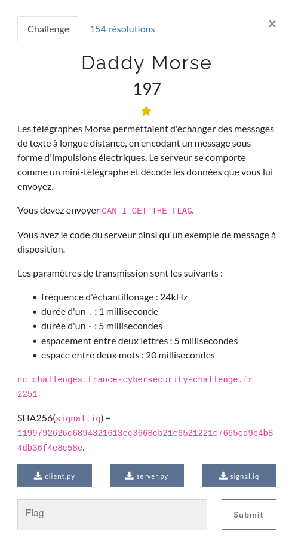

### HARDWARE / Daddy morse





### Files

Les sources du client et du serveur non sont fournies, ainsi qu'un exemple de signal permettant d'envoyer "HELLO" au serveur.

Une solution est d'utiliser un logiciel de radio logicielle, comme `GnuRadio` par exemple pour générer un signal respectant les spécifications de l'énoncé.

Pour ma part, j'ai scripté un encodeur qui produit les 1 et 0 nécessaires.

Le plus compliqué ayant été de comprendre comment ma suite de 1 et de 0 était transformée par numpy en tableau de complexes.

Il s'avère que :
```
- 1 -> (1+1j)
- 0 -> (0+0j)
```

De façon pas très propre j'ai don créé un numpy array de complexes vide, puis l'ai alimenté deux fois avec ma suite de 1 et 0, une fois pour la partie imaginaire une fois pour la parie réelle.

```python
s = np.array([0] * (len(encoded_msg)),dtype = np.complex64)
s.real = np.array( encoded_msg )
s.imag = np.array( encoded_msg )
```

Voici le code pour résoudre ce challenge :


```python
from pwn import *
import numpy as np
import base64

SAMP_RATE = 24e3
MAX_LEN = 256000

FREQ = 5e3

TIMING_DOT = 1/1000
TIMING_DASH = 5/1000
TIMING_SEP_LETTER = 5/1000
TIMING_SPACE = 20/1000

DOT = "."
DASH = "-"
SEP_LETTER = "_"
SPACE = " "


msg = "CAN I GET THE FLAG"

alphabet = { 'A':'.-', 'B':'-...',
			'C':'-.-.', 'D':'-..', 'E':'.',
			'F':'..-.', 'G':'--.', 'H':'....',
			'I':'..', 'J':'.---', 'K':'-.-',
			'L':'.-..', 'M':'--', 'N':'-.',
			'O':'---', 'P':'.--.', 'Q':'--.-',
			'R':'.-.', 'S':'...', 'T':'-',
			'U':'..-', 'V':'...-', 'W':'.--',
			'X':'-..-', 'Y':'-.--', 'Z':'--..',
			'1':'.----', '2':'..---', '3':'...--',
			'4':'....-', '5':'.....', '6':'-....',
			'7':'--...', '8':'---..', '9':'----.',
			'0':'-----', ', ':'--..--', '.':'.-.-.-',
			'?':'..--..', '/':'-..-.', '-':'-....-',
			'(':'-.--.', ')':'-.--.-'}


def morse_encode(msg):
	res = ""
	for word in msg.split(" "):
		for letter in word:
			if letter in alphabet:
				res += alphabet[letter]
			elif letter == "":
				continue
			else:
				return "error"
			res+="_"
		res += " "
	return res.strip()[:-1]


def timing(c):
	return int(c * SAMP_RATE)


def convert_char(c):
	if c == DOT:
		return timing(TIMING_DOT)
	if c == DASH:
		return timing(TIMING_DASH)
	if c == SEP_LETTER:
		return timing(TIMING_SEP_LETTER)
	if c == SPACE:
		return timing(TIMING_SPACE)


encoded_msg = []

for c in morse_encode(msg):


	# if c == DOT:
	# 	encoded_msg += [1] * 24
	# 	encoded_msg += [0] * 24

	# if c == DASH:
	# 	encoded_msg += [1] * 120
	# 	encoded_msg += [0] * 24

	# if c == SEP_LETTER:
	# 	encoded_msg += [0] * (120-24)

	# if c == SPACE:
	# 	encoded_msg += [0] * (480 - 120 -24)

	if c == DOT or c == DASH:
		encoded_msg += [1] * convert_char(c)
		encoded_msg += [0] * 2

	if c == SEP_LETTER or c == SPACE:
		encoded_msg += [0] * convert_char(c)
		encoded_msg += [1] * 2

encoded_msg = encoded_msg

s = np.array([0] * (len(encoded_msg)),dtype = np.complex64)

s.real = np.array( encoded_msg )
s.imag = np.array( encoded_msg )

print(s)
print(len(s))


HOST = args.HOST or "challenges.france-cybersecurity-challenge.fr"
PORT = args.PORT or  2251

c = remote(HOST, PORT)

encoded_signal = base64.b64encode(s.tobytes())

c.recvuntil(b"> ")
c.sendline(encoded_signal)
print(c.recvline())

```
