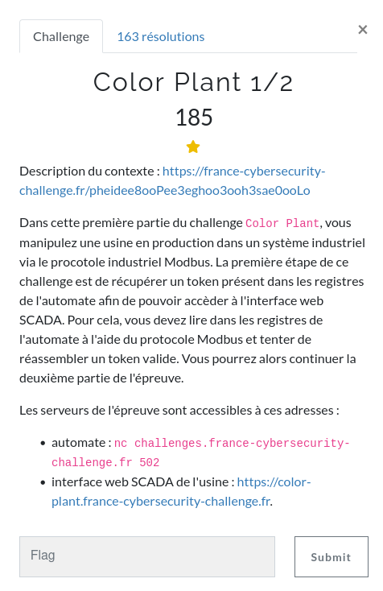
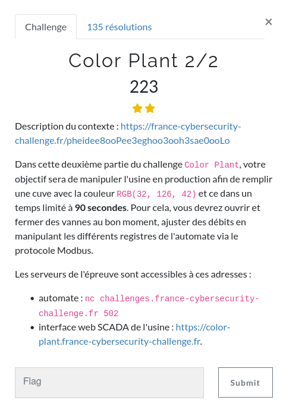
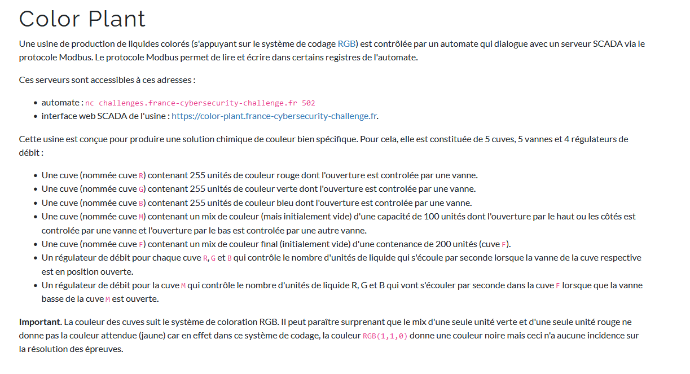
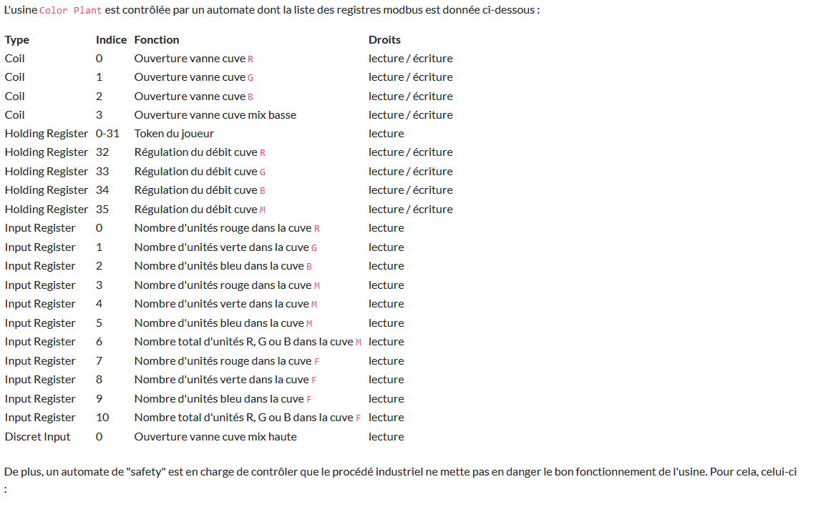
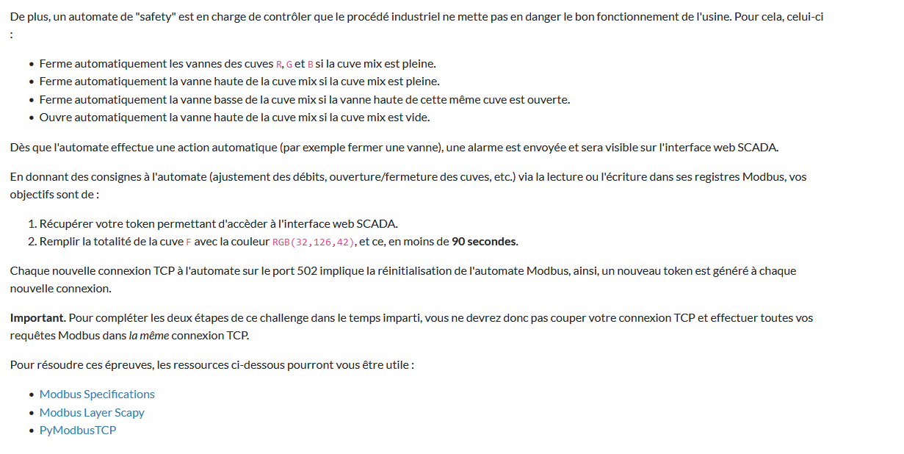

### MISC / Color Plant 1 & 2

<p align="center">
  
</p>

<p align="center">
  
</p>


Challenge en deux parties, assez dense du point de vue de la documentation fournie, que je ne reprendrai pas exhaustivement ici.
Néanmoins, nous avons accès à deux interface :
- une interface web de supervision du système industriel (dont l'accès constitue le premier flag)
- une CLI qui nous permet via le protocole modbus d'envoyer des requêtes PLC contrôlant les capteurs et effecteurs du système.


<p align="center">
  
</p>

<p align="center">
  
</p>

<p align="center">
  
</p>

<p align="center">
  
</p>


### Remarques

La documentation décrit précisément les différents registres du PLC, leur rôle et leur type.

Par ailleurs, il est important de comprendre le fonctionnement du mode safety, en particulier la nécessité de remplir entièrement la cuve M pour qu'elle se vide dans la cuve finale (pas de registre pour contrôler la vanne basse de M).

Les registres que j'utiliserai sont de deux types :
- coil : on y écrit une valeur, qui correspond à un ordre transmis par le PLC à un effecteur (1 écriture = 1 action)
- holding : sensiblement pareil, mais la valeur est conservé, cela s'apparente à un registre d'état

D'autres registres nous permettent au besoin d'interroger les cuves pour connaître leur état de remplissage en R, G, B. Toutefois, je ne les utiliserai pas, le système étant simulé, une action produit le résultat escompté (déterminisme) donc la bonne quantité de couleur est réellement versée.


### Tour du SI

La première étape constitue à récupérer un token en interrogeant le bon registre, celui-ci nous donne alors accès à l'interface web (1 token = 1 session)

Très bonne nouvelle, dans les ressources est indiqué une bibliothèque en python implémentant Modbus ... et très simple d'utilisation.

`Holding Register 		0-31 		Token du joueur 		lecture`

Il suffit d'interroger ce registre pour récupérer un tocken valide et le 1er flag sur la page web de supervision.

```python
c = ModbusClient(host="challenges.france-cybersecurity-challenge.fr", port=502, unit_id=1, auto_open=True)
h_token = 0
regs = c.read_holding_registers(h_token, 32)

if regs:
    print("Token : ", ''.join( chr(_) for _ in regs))
else:
    print("read error")
```


Ensuite quelques tests sur les différents registres nous permettent rapidement de récupérer de nouvelles informations :
- le débit max est de 5
- la cuve M ne s'ouvre pas si elle n'est pas pleine

La capacité de la cuve M est de 100L
- en ouvrant en débit max R, G, B, on peut la remplir en 7 secondes
- il faut 20 secondes pour vider la cuve M.
- il m'a semblé nécessaire de mettre des pauses lors des bascules (remplissage/vidage), je ne sais pour le coup pas si c'est lié au réseau ou nécessaire.


Il faut alors un peu de calculs simples pour mettre en place les étapes suivantes (commentaires dans le code)

```python
from pyModbusTCP.client import ModbusClient
import time

c = ModbusClient(host="challenges.france-cybersecurity-challenge.fr", port=502, unit_id=1, auto_open=True)
h_token = 0
regs = c.read_holding_registers(h_token, 32)

if regs:
    print("Token : ", ''.join( chr(_) for _ in regs))
else:
    print("read error")

time.sleep(7)

print("Sending commands")

r = 32
g = 126
b = 42

c_r = 0
c_g = 1
c_b = 2
c_m_b = 3

h_deb_r = 32
h_deb_g = 33
h_deb_b = 34
h_deb_m = 35


# remplir M avec 20 r / 50 g / 30 b
# augmenter le debit r g b
c.write_single_register(h_deb_r, 2)
c.write_single_register(h_deb_g, 5)
c.write_single_register(h_deb_b, 3)

count = 10

while( count > 0):
    c.write_single_coil(c_m_b, 0)
    c.write_single_coil(c_r ,1)
    c.write_single_coil(c_g ,1)
    c.write_single_coil(c_b ,1)
    time.sleep(1)
    count -= 1

# fermeture des vannes
c.write_single_coil(c_r, 0)
c.write_single_coil(c_g, 0)
c.write_single_coil(c_b, 0)
# remise a zero des debit
c.write_single_register(h_deb_r, 0)
c.write_single_register(h_deb_g, 0)
c.write_single_register(h_deb_b, 0)

time.sleep(1)

# augmenter debit de M
c.write_single_register(h_deb_m, 5)

# ouvrir vanne M
count = 20
while( count > 0):
    #c.write_single_coil(c_m_h, 0)
    c.write_single_coil(c_r, 0)
    c.write_single_coil(c_g, 0)
    c.write_single_coil(c_b, 0)
    c.write_single_coil(c_m_b, 1)
    time.sleep(1)
    count -= 1

# fermer M bas
c.write_single_coil(c_m_b, 0)


# remplir avec 12 r / 76 g / 12 b
# regler les debits

c.write_single_register(h_deb_r, 4)
c.write_single_register(h_deb_g, 4)
c.write_single_register(h_deb_b, 4)

count = 19
while( count > 0 ):
    c.write_single_coil(c_m_b, 0)
    if count > 16:
        c.write_single_coil(c_r, 1)
        c.write_single_coil(c_b, 1)
    else:
        c.write_single_coil(c_r, 0)
        c.write_single_coil(c_b, 0)

    c.write_single_coil(c_g, 1)

    time.sleep(1)
    count -= 1


# fermeture des vannes
c.write_single_coil(c_r, 0)
c.write_single_coil(c_g, 0)
c.write_single_coil(c_b, 0)
# remise a zero des debit
c.write_single_register(h_deb_r, 0)
c.write_single_register(h_deb_g, 0)
c.write_single_register(h_deb_b, 0)

time.sleep(1)


# augmenter debit de M
c.write_single_register(h_deb_m, 5)

# ouvrir vanne M
count = 20
while( count > 0):
#c.write_single_coil(c_m_h, 0)
    c.write_single_coil(c_r, 0)
    c.write_single_coil(c_g, 0)
    c.write_single_coil(c_b, 0)
    c.write_single_coil(c_m_b, 1)
    time.sleep(1)
    count -= 1

# fermer M bas
c.write_single_coil(c_m_b, 0)


```


<p align="center">
  
</p>
