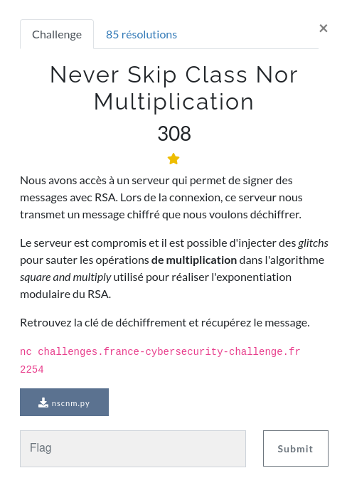
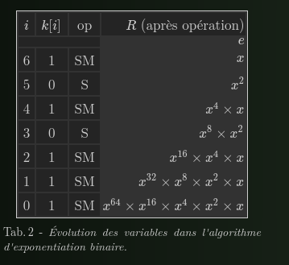

### SIDE CHANNEL / Never Skip Class Nor Multiplication




### FILES

Le challenge nous fournit les sources du serveur, celui-ci implémante l'algorithme Square and Multiply utilisé pour l'exponentiation modulaire, ici dans le cas de RSA.

Dans un premier temps il nous permet de signer un message `2*BITS+1` fois (donc avec la clef privée), en omettant à chaque fois une opération multiplication de notre choix.

Puis il nous envoie le flag chiffré avec la clef publique correspondante.

Ainsi, si nous parvenons à deviner la clef privée grace aux signatures successives, nous pourrons déchiffrer ce dernier.


### Square and mutliply

Une bonne ressource pour comprendre le fonctionnement de l'algorithme S&M :

http://zanotti.univ-tln.fr/ALGO/II/SquareMultiply.html




La clef est parcouru de son bit de poids fort à son bit de poids faible, pour chaque bit l'élévation au carré est effectuée, pour les bits à 1, la multiplication est effectuée.

### Résolution

L'idée consiste à demander au serveur de sauter la multiplication sur chaque bit un à un lors de la signature d'un message que l'on connait.

Si nous parvenons à vérifier la signature (c'est à dire déchiffrer ce message avec la clef publique), cela signifie que la signature n'a pas été perturbée, ou encore que nous avons demandé à sauter une opération qui n'est pas effectuée: bit à 0.
Dans le cas contraire, cette opération correspondait à un bit à 1 dans la clef.

Une fois la clef reconstituée, nous pourront alors déchiffrer le flag.

```python
import socket
from pwn import *
from Crypto.Util.number import long_to_bytes
from time import sleep


BITS = 512
msg = b'toto'


HOST = "challenges.france-cybersecurity-challenge.fr"
PORT = 2254

r = remote(HOST, PORT)

rep = r.recvuntil(b'\n')
n = int(rep.split(b' ')[2].decode())

rep = r.recvuntil(b'\n')
e = int(rep.split(b' ')[2].decode())


print("n = ", n)
print("e = ", e)

d = ["0"] * 2 * BITS

for i in range(2 * BITS + 1 ):

    rep = r.recvuntil(b'msg = ')

    r.send(msg + b'\n')
    _ = r.recvuntil(b'skip = ')
    r.send((str(i) + '\n').encode())

    if i > 0:       

        c = int(rep.split(b'\n')[0].decode())
        if long_to_bytes(pow(c,e,n)) != msg:
            d[i-1] = "1"
        print(i, end=' ')

print(' ')

c = r.recvuntil(b'c = ')
c = r.recv()
print(c)
c = int(c.replace(b'\n',b'').decode())

print("c = ", c)

k = int(''.join(d), 2)
print(k)

print(long_to_bytes(pow(int(c),k,n)))


```
