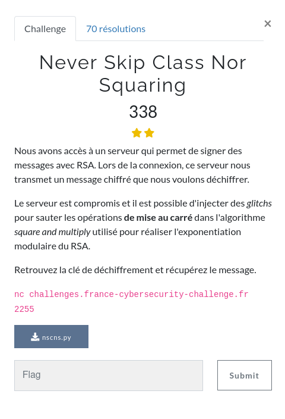
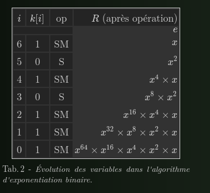

### SIDE CHANNEL / Never Skip Class Nor Squaring




### FILES

Comme dans le challenge `Never Skip Class Not Multiply` le serveur nous permet de sauter une opération à chaque soumission du message à signer, mais cette fois la mise au carré.


### Square and mutliply

Une bonne ressource pour comprendre le fonctionnement de l'algorithme S&M :

http://zanotti.univ-tln.fr/ALGO/II/SquareMultiply.html




La clef est parcouru de son bit de poids fort à son bit de poids faible, pour chaque bit l'élévation au carré est effectuée, pour les bits à 1, la multiplication est effectuée.

### Résolution

L'idée consiste à demander au serveur de sauter la mise au carré sur chaque bit un à un lors de la signature d'un message que l'on connait.


En revanche la mise au carré étant effectuée quelque soit le bit de clef correspondant (0 ou 1), nous n'auront pas directement un oracle pour en deviner la valeur.

Toutefois, un peu de mathématique ou alors la réalisation de l'algorithme à la main en sautant 1 ou 0, permet de se rendre compte qu'il faut considérer deux "clefs successives" (en fait pour nous deux messages signés successifs).

S'ils sont différents, la modification apportée à la première clef correspondait à un 1, sinon un 0.

```python
import socket
from pwn import *
from Crypto.Util.number import long_to_bytes
from time import sleep


BITS = 256

msg = b'toto'
last = 0

HOST = "challenges.france-cybersecurity-challenge.fr"
PORT = 2255

r = remote(HOST, PORT)

rep = r.recvuntil(b'\n')
n = int(rep.split(b' ')[2].decode())

rep = r.recvuntil(b'\n')
e = int(rep.split(b' ')[2].decode())

print("n = ", n)
print("e = ", e)

d = ["0"] * 2 * BITS


for i in range(2 * BITS + 1 ):

	rep = r.recvuntil(b'msg = ')

	r.send(msg + b'\n')
	_ = r.recvuntil(b'skip = ')
	r.send((str(i) + '\n').encode())

	if i == 1:
		c = int(rep.split(b'\n')[0].decode())
		last = c
	if i > 1:
		c = int(rep.split(b'\n')[0].decode())
		if c != last:
			d[i-2] = "1"
		last = c
		print(i, end=' ')
		#print(d)


print(' ')

rep = r.recvuntil(b'c = ')
print(rep)

c = int(rep.split(b'\n')[0].decode())
if c != last:
	d[-1] = "1"

c = r.recv()
print(c)
c = int(c.replace(b'\n',b'').decode())

print("c = ", c)

k = int(''.join(d), 2)
print(k)

print(long_to_bytes(pow(int(c),k,n)))


```
